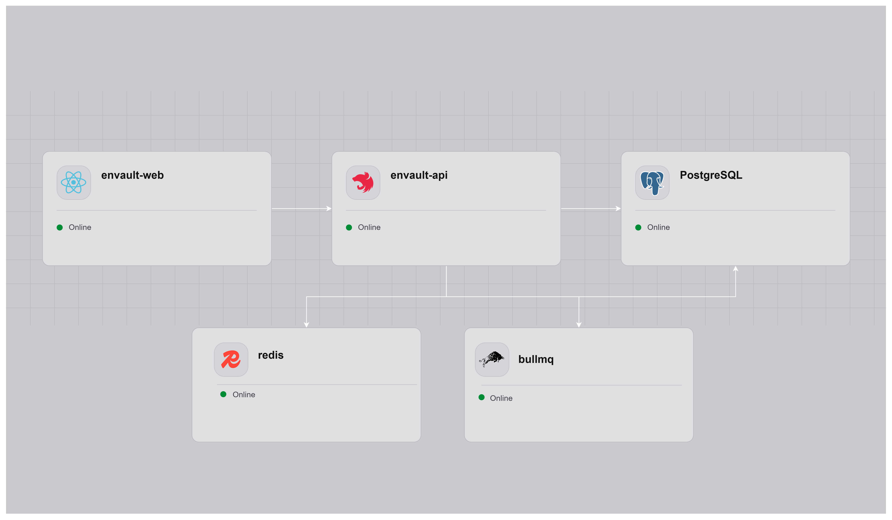

# Deployment — Railway

> 🇬🇧 English version: [../en/deployment-railway.md](../en/deployment-railway.md)

> **Esta guía es un template de deploy, no el único camino.** EnVault Management corre en cualquier plataforma de contenedores con una instancia de PostgreSQL 16+. Railway está documentado acá porque te da un stack funcional en menos de una hora, lo cual es útil como punto de partida o para evaluar. Para Kubernetes, Fly.io, AWS ECS, o Docker self-hosted, aplican las mismas variables y servicios — solo cambia la capa de orquestación.

Esta guía muestra cómo deployar EnVault Management en [Railway](https://railway.com). Auth corre dentro de la API — no se necesita ningún servicio de auth externo.



---

## Project — EnVault Management Dumps (app stack)

### Services

| Service | Origen | Builder | Dockerfile | Puerto público |
|---------|--------|---------|------------|----------------|
| `envault-web` | GitHub repo (`main`) | Dockerfile | `apps/web/Dockerfile` | `80` |
| `envault-api` | GitHub repo (`main`) | Dockerfile | `apps/api/Dockerfile` | (interno) |
| `Postgres` | Plugin Railway | — | — | (interno) |

> **`envault-api` no tiene puerto público.** El browser nunca le habla directo — el nginx de `envault-web` proxea `/api/*` hacia ella por la red privada de Railway (`envault-api.railway.internal`, zero-config dentro de un mismo project environment). Sólo `envault-web` tiene dominio público.

### Config común para los dos services GitHub

En **Settings → Build**:

- **Root Directory**: `/` (raíz del repo — NO `apps/api` ni `apps/web`)
- **Builder**: Dockerfile
- **Dockerfile Path**: `apps/api/Dockerfile` o `apps/web/Dockerfile` según el service

> **Por qué Root Directory `/`**: los Dockerfiles esperan el contexto desde la raíz del monorepo para acceder a `pnpm-workspace.yaml` y `pnpm-lock.yaml`. Si Railway te ubica en `apps/api`, el build falla.

En **Settings → Networking**:

- `envault-web`: Generate Domain → asigna `https://<service>-production.up.railway.app`, Target Port `80`.
- `envault-api`: sin dominio, sin networking público. Sólo necesita ser alcanzable en `envault-api.railway.internal:3000`, que Railway conecta automáticamente en cuanto ambos services existen en el mismo project environment.

### Variables — `envault-api`

```bash
# Runtime
NODE_ENV=production
PORT=3000

# Postgres (reference variables al plugin)
DB_HOST=${{Postgres.PGHOST}}
DB_PORT=${{Postgres.PGPORT}}
DB_NAME=${{Postgres.PGDATABASE}}
DB_USER=${{Postgres.PGUSER}}
DB_PASSWORD=${{Postgres.PGPASSWORD}}

# Better Auth
BETTER_AUTH_SECRET=<string-hex-de-64-chars>
# El dominio del web, no el de la api — la api no tiene. Es la dirección
# que usa el BROWSER para llegar a /api/auth/*, que nginx proxea.
BETTER_AUTH_URL=https://${{envault-web.RAILWAY_PUBLIC_DOMAIN}}
BETTER_AUTH_ADMIN_EMAIL=admin@example.com
BETTER_AUTH_ADMIN_PASSWORD=<password-fuerte>

# La exige la validación de env, y queda para cualquier deploy que no use
# el proxy de nginx (ej. dev local hablándole directo a la api). Con el
# proxy en el medio el browser nunca llega a la api cross-origin, así que
# acá no tiene efecto sobre tráfico real — queda inerte, no es load-bearing.
CORS_ORIGIN=https://${{envault-web.RAILWAY_PUBLIC_DOMAIN}}

# Cloudflare R2 (storage de dumps)
R2_ACCOUNT_ID=<32-char hex de Cloudflare Dashboard>
R2_ACCESS_KEY_ID=<de un R2 API Token>
R2_SECRET_ACCESS_KEY=<del mismo token, solo se muestra al crear>
R2_BUCKET_NAME=envault-dumps
```

> **Reference variables**: `${{Postgres.PGHOST}}` y `${{envault-web.RAILWAY_PUBLIC_DOMAIN}}` son resueltas automáticamente por Railway al hostname/dominio real del recurso referenciado. Cambian solas si renombrás services.

> **R2_ACCOUNT_ID ≠ R2_ACCESS_KEY_ID**: el primero es el Cloudflare Account ID (visible en el dashboard, arriba a la derecha). El segundo lo genera Cloudflare al crear un R2 API Token. Son strings hex de 32 chars distintos. Confundirlos produce `SSL alert 40` críptico, no un error claro.

### Variables — `envault-web`

Las `VITE_*` deben estar **disponibles en build time** porque Vite las hornea en el bundle. Railway las pasa como build args automáticamente cuando están en la pestaña Variables del service.

```bash
# Sin setear (o vacía) a propósito: la SPA llama a /api/* relativo,
# y nginx lo proxea a envault-api por la red privada.
# VITE_API_URL=
VITE_APP_BASE_URL=https://${{RAILWAY_PUBLIC_DOMAIN}}

# La lee templates/default.conf.template al arrancar el container — no
# es una VITE_*, así que es una Service Variable de runtime común, no
# un build arg.
#
# Usá la reference variable, no un hostname escrito a mano: el nombre
# DNS privado de un service en Railway NO es siempre <service-name>.railway.internal
# — algunos environments tienen un dominio privado más viejo, con otro
# nombre. ${{envault-api.RAILWAY_PRIVATE_DOMAIN}} resuelve siempre al
# dominio privado real de ese service, sea cual sea.
API_UPSTREAM=${{envault-api.RAILWAY_PRIVATE_DOMAIN}}:3000
```

### Orden de creación

1. Agregar el plugin **Postgres** al project.
2. Crear service **envault-api**, conectarlo al repo, configurar variables. No generarle dominio.
3. Crear service **envault-web**, conectarlo al repo, configurar variables (incluido `API_UPSTREAM` apuntando a `envault-api.railway.internal:3000`), generar su dominio.
4. Volver al `envault-api` y setear `BETTER_AUTH_URL` y `CORS_ORIGIN` al dominio del web, que ya existe.


> **Better Auth corre dentro de la API — no se necesita ningún servicio de auth externo.** La API gestiona todo el auth en `/api/auth/*`. Los usuarios y sesiones se almacenan en la misma instancia de PostgreSQL que el resto de los datos de EnVault Management.

---

## Gotchas comunes

| Síntoma | Causa real | Fix |
|---------|------------|-----|
| nginx en web devuelve 404 en `/` | Target port en Railway ≠ puerto del Dockerfile | Settings → Networking → cambiar target port a `80` |
| `/api/*` devuelve `502 Bad Gateway`, sin crash al arrancar | `API_UPSTREAM` no está seteada, o `envault-api` todavía no existe en este environment | Setear `API_UPSTREAM=envault-api.railway.internal:3000` en `envault-web` y redeployar `envault-web` una vez que `envault-api` esté arriba. Antes esto tumbaba nginx al arrancar el container (`host not found in upstream`) y obligaba a sacar el proxy entero — ya no, porque el upstream ahora resuelve por request en vez de al cargar la config (ver `apps/web/templates/default.conf.template`) |
| `EPROTO ... SSL alert 40` desde api | `R2_ACCOUNT_ID` mal seteado → endpoint inexistente | Confirmar account ID en Cloudflare Dashboard, no confundir con access key |
| SPA carga con strings vacíos en URLs | Variables `VITE_*` no llegaron al build | Confirmar que están como Service Variables (no Shared) y disparar redeploy |
| `flag '--mount=type=cache,...' is missing the cacheKey prefix` | BuildKit de Railway exige `id=s/<service>-...` | Sacar los cache mounts — Railway tiene layer cache propio |

## Releases

El flujo de versionado está en `.github/workflows/ci.yml` + `.releaserc.json`. Cada push a `main` con commit convencional dispara semantic-release: calcula la versión, genera changelog, crea tag y GitHub Release.

Railway redeploya automáticamente en cada push a `main` (configurable per service en Settings → Service → Auto-deploy).
